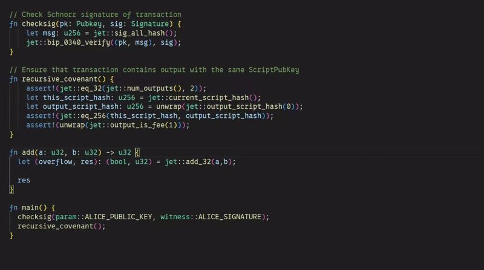
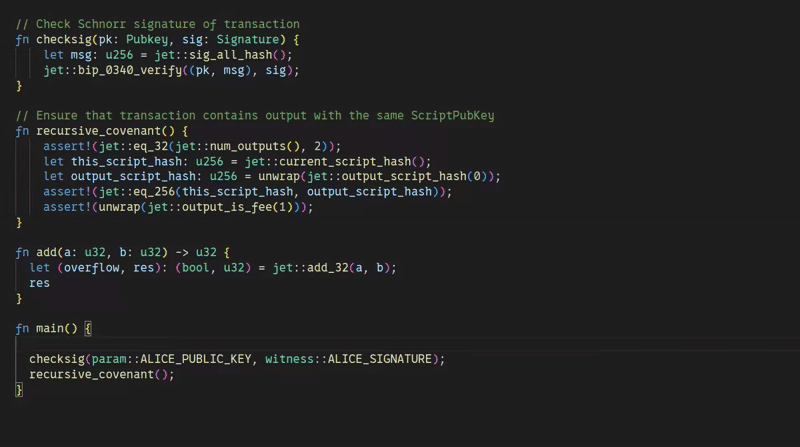
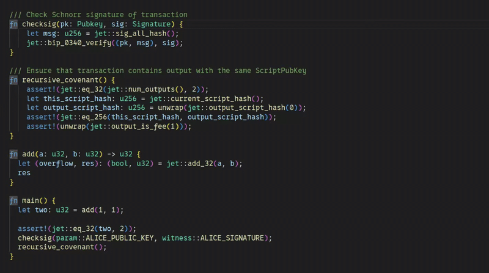
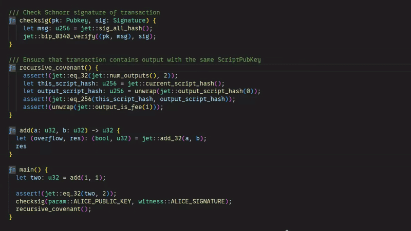

# SimplicityHL LSP

Language Server for [SimplicityHL language](https://simplicity-lang.org/).

## Features

- Basic diagnostic for SimplicityHL code
  


- Completions of built-ins, jets and functions



- Hover for built-ins, jets and functions, with support of documentation



- Go to definition for functions



## Installation

Install Language Server using `cargo`:

```bash
cargo install simplicityhl-lsp
```

## Integration with editors

### Neovim

#### LSP

0. Install `simplicityhl-lsp` to your `PATH`.

1. Include this Lua snippet to your Neovim config:

```lua
vim.filetype.add({
	extension = {
		simf = "simf",
	},
})

vim.lsp.config["simplicityhl-lsp"] = { cmd = { "simplicityhl-lsp" }, filetypes = { "simf" }, settings = {} }
vim.lsp.enable("simplicityhl-lsp")
```

2. Open `.simf` file and check that LSP is active ("attached"):

```vim
:checkhealth vim.lsp
```

#### Tree-sitter (Highlighting)

Currently, the Language Server does not provide any syntax highlighting on its own, but you can install tree-sitter for SimplicityHL:

0. Set up the [`nvim-treesitter`](https://github.com/nvim-treesitter/nvim-treesitter/tree/main) plugin.

1. Include this Lua snippet in your Neovim config to register parser:

```lua
vim.api.nvim_create_autocmd("User", {
	pattern = "TSUpdate",
	callback = function()
		require("nvim-treesitter.parsers").simplicityhl = {
			install_info = {
				url = "https://github.com/distributed-lab/tree-sitter-simplicityhl",
				queries = "queries",
			},
			filetype = "simf",
			tier = 0,
		}
	end,
})

vim.treesitter.language.register("simplicityhl", { "simf" })

vim.api.nvim_create_autocmd("FileType", {
	pattern = { "simf" },
	callback = function()
		vim.treesitter.start()
	end,
})
```

2. Restart Neovim and run:

```vim
:TSInstall simplicityhl
```

If everything is working correctly, you should see syntax highlighting in `.simf` files.

**Note:** This method is compatible only with `nvim-treesitter` v0.10 or newer.

